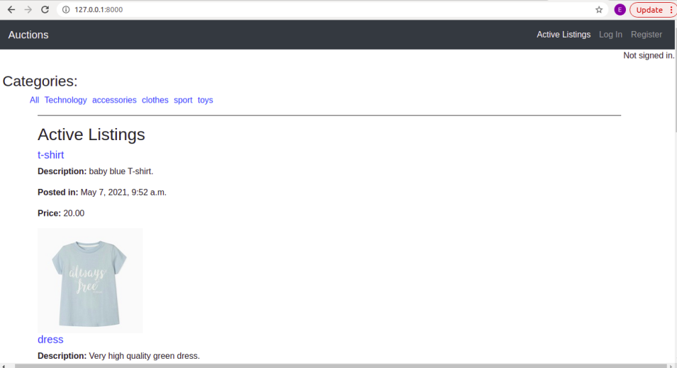
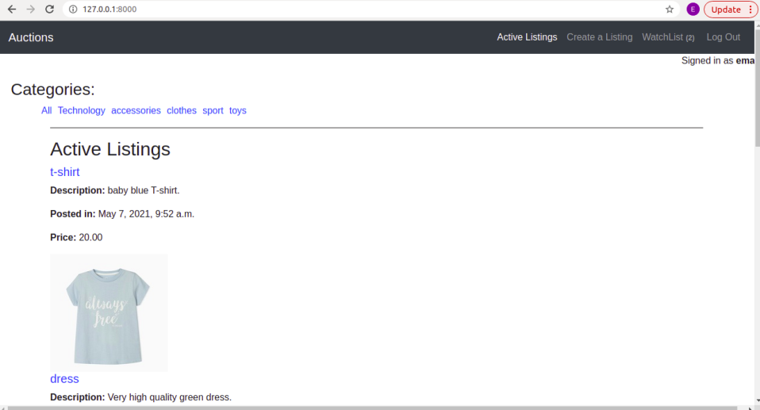
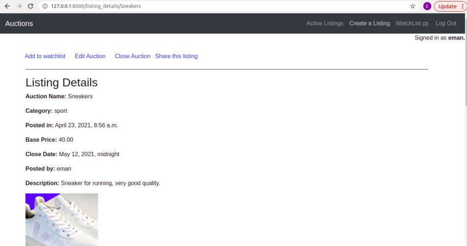
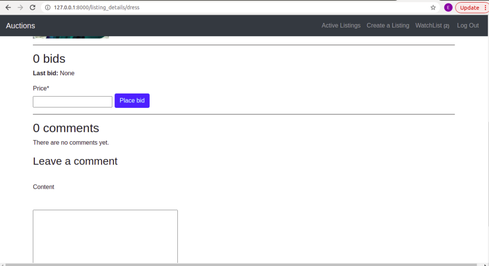

# Auctions WebSite
Commerce website allows users to make auctions and bids on these auctions.

## Project Explanation:

This project have the following functionality:
- In home page **Active Listings** are listed. Anonymous user will see this home page. 

- If the user logged in, he have different options. He can create a new listing from home page. He can also edit his own listing, close his auction, add item to his watchlist, and add a bid or comment on listing details page.

- When clicking on a particular listing, user will be directed to the details page of this listing where user can see all details, make a bid, leave a comment, or share listing with others.
- Logged in users can aslo add and delete listings from their watchlist.

- In home page all **active listings** are listed. However, if the user chooses a certain category, only listings of this category will be displayed.
- When close date of a particular auction is reached, users can't make bids on that listing anymore . 

- When a user make  a bid, he should consider that the bid must be at least as or greater than **base price** of auction if there is no bid till now. if the auction has bids, the current bid should be at least as or greater than **last bid** on this auciton.

